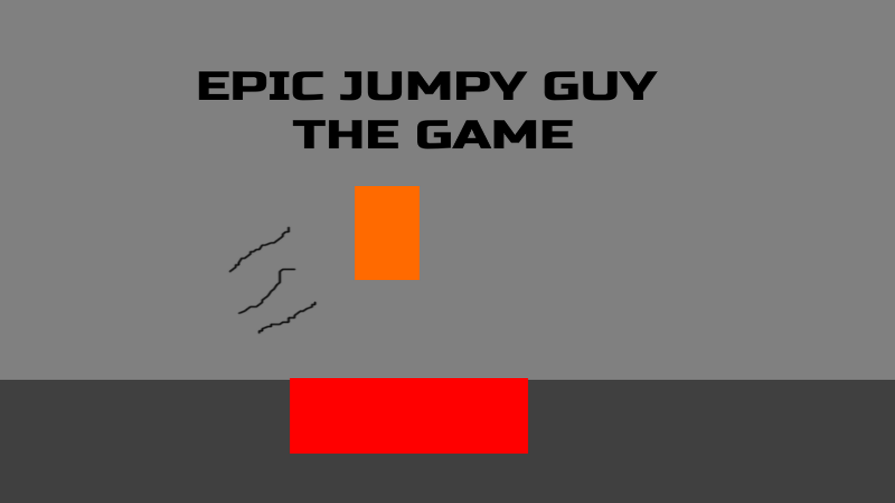

# Simple Platformer

A small, completely original game that I coded in Godot, using GDScript, for a grade 11 school project.

In the game, you play as an orange blob, and the goal is to reach the end of the obstacle course.

Use the left and right arrow keys to move, and the spacebar to jump (jump height depends on duration the key is held). Other movement mechanics include wall slides and wall jumps.

The game itself is included as an executable alongside a .pck file, and the code is included as .txt files in the "Scripts" folder. Note: The .exe must be in the same folder as the .pck to run!

As one of my first big projects working with Godot, I explored many new concepts and features within the game engine, and I'm super happy with how it all turned out (the movement feels so smooth)!

